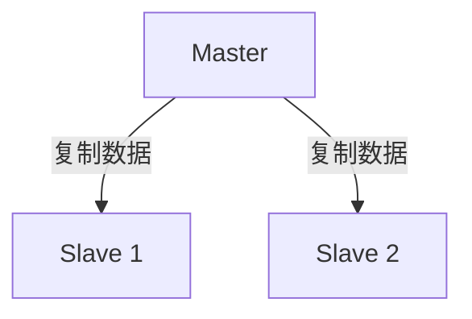
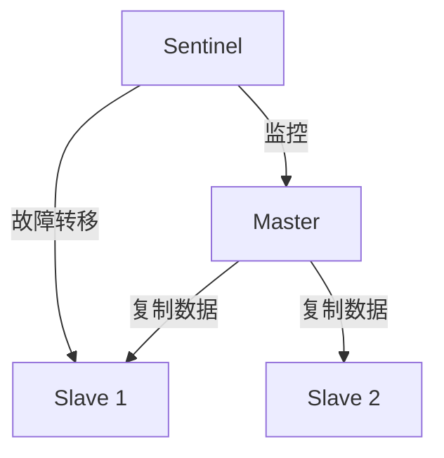
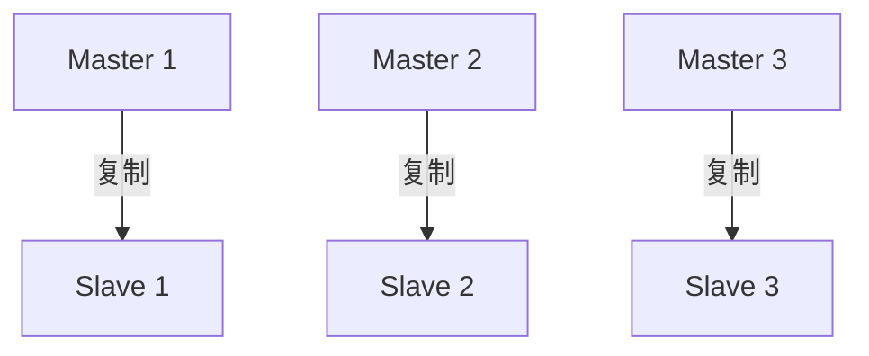
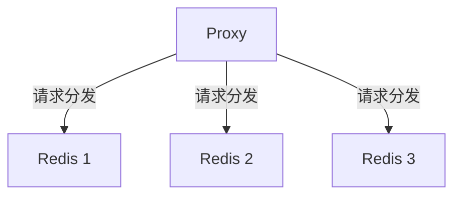

# Redis 集群模式详解

本篇详细解析各个模式的 架构、优缺点、适用场景、配置方法，并对比不同集群方案的适用性和性能。

## 1. Redis 集群模式概览

| 模式                      | 架构              | 是否支持分片 | 是否支持高可用 | 自动故障转移     | 适用场景           |
| ----------------------- | --------------- | ------ | ------- | ---------- | -------------- |
| 主从复制（Master-Slave）      | 一主多从，读写分离       | ❌ 否    | ❌ 否     | ❌ 否（需手动切换） | 简单读多写少的应用      |
| 哨兵模式（Sentinel）          | 主从+自动故障转移       | ❌ 否    | ✅ 是     | ✅ 是        | 中小型高可用集群       |
| Cluster（分片集群）           | 多主多从，数据分片       | ✅ 是    | ✅ 是     | ✅ 是        | 大数据量+高可用       |
| 代理模式（Codis / Twemproxy） | 代理 + 多 Redis 实例 | ✅ 是    | ✅ 是     | ✅ 是        | 兼容旧版 Redis 客户端 |

## 2. Redis 主从复制（Master-Slave）

架构

* 一个 Master，多个 Slave
* Master 负责写入，Slave 负责读请求
* 不支持自动故障切换，如果 Master 宕机，需要手动切换 Slave 为 Master。




适用场景

* 适用于 读多写少 场景（如缓存、商品查询）。
* 适用于 小规模集群，不需要自动故障恢复。

配置

```java
# Slave 配置
replicaof <master-ip> <master-port>
```

缺点

* 单点故障风险：Master 挂了，需要手动切换。
* 写性能受限：只有 Master 处理写请求。

## 3. Redis 哨兵模式（Sentinel）

架构

* 主从复制 + 监控 & 自动故障切换。
* 当 Master 宕机，Sentinel 选举新的 Master，自动切换。




适用场景

* 中小型 Redis 高可用场景（10GB 级别）。
* 适用于电商、金融、游戏等需要高可用的系统。

配置

```sh
sentinel monitor mymaster <master-ip> <master-port> 2
```

缺点

* 仍然是单点写（Master），写性能有限。
* 故障转移可能造成短暂的数据丢失（脑裂问题）。

## 4. Redis Cluster（分片集群模式）

架构

* 数据分片（Sharding），多个 Master，每个 Master 负责部分数据。
* 每个 Master 有多个 Slave，提供高可用性。
* 无中心化架构，每个节点都能独立处理请求。



适用场景

* 大规模数据存储（100GB+），解决单机 Redis 内存不足问题。
* 高并发读写（如电商、广告推送），避免单点瓶颈。\


配置

```
redis-cli --cluster create 192.168.1.1:6379 192.168.1.2:6380 192.168.1.3:6381 --cluster-replicas 1
```

优点

* 数据分片，提高存储能力。
* 多主多从，支持高并发和高可用。

缺点

* 客户端必须支持 Cluster 协议（如 JedisCluster）。
* 多键操作（如 MGET）受限，必须在同一分片上执行。

5\. Redis Proxy（Codis / Twemproxy）

架构

* 使用代理（Proxy）管理多个 Redis 实例，对客户端透明。
* 支持分片和高可用，避免客户端直接操作分片逻辑。



适用场景

* 希望简化 Redis 分片管理。
* 希望兼容传统 Redis 客户端（不支持 Cluster）。

✅ 代码示例

```
codis-proxy --config=proxy.toml --log=proxy.log
```

优点

* 对应用透明，兼容老版本 Redis 客户端。
* 支持动态扩展，比 Redis Cluster 更易维护。

缺点

* Proxy 可能成为瓶颈（单点故障）。
* 不如 Redis Cluster 原生支持分片高效。

## 6. Redis 集群模式对比

| 模式           | 是否支持分片 | 是否支持高可用 | 故障转移 | 适用场景         |
| ------------ | ------ | ------- | ---- | ------------ |
| 主从复制         | ❌ 否    | ❌ 否     | ❌ 手动 | 读多写少，简单部署    |
| Sentinel     | ❌ 否    | ✅ 是     | ✅ 自动 | 中小型高可用 Redis |
| Cluster      | ✅ 是    | ✅ 是     | ✅ 自动 | 大数据量 + 高可用   |
| Proxy（Codis） | ✅ 是    | ✅ 是     | ✅ 自动 | 兼容旧 Redis，分片 |

## 7. 选型建议

| 需求            | 推荐方案              |
| ------------- | ----------------- |
| 单机 / 读多写少     | 主从复制              |
| 中小型集群（高可用）    | Sentinel          |
| 大规模数据（分片+高可用） | Cluster           |
| 兼容老系统（代理）     | Codis / Twemproxy |

