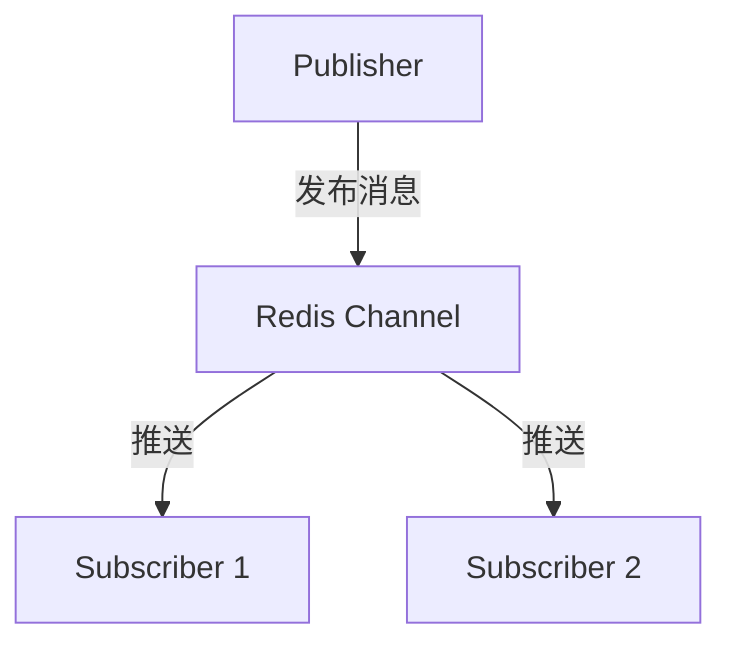
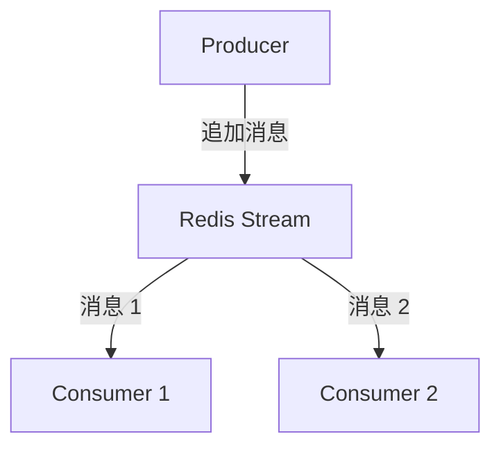

# Redis Pub/Sub vs. Redis Stream 对比

## 1. Redis Pub/Sub vs. Stream 对比概览

| 对比项   | Redis Pub/Sub     | Redis Stream        |
| ----- | ----------------- | ------------------- |
| 消息模型  | 发布订阅（Pub/Sub）     | 消息队列（Message Queue） |
| 消息存储  | 不存储（实时推送）         | 持久化存储（可回放）          |
| 消息可靠性 | 无保证，掉线丢失          | 保证消息持久化，可消费多次       |
| 消息顺序  | 无保证               | 保证 FIFO（先进先出）       |
| 消费模式  | 广播模式（所有订阅者收到相同消息） | 消息队列（每个消费者组独立消费）    |
| 持久化   | ❌ 不存储消息           | ✅ 存储在 Redis 内存/磁盘   |
| 适用场景  | 实时通知、订阅推送         | 日志系统、流计算、MQ         |

&#x20;Pub/Sub 适用于实时推送，Stream 适用于可靠消息队列。

## 2. Redis Pub/Sub（发布/订阅）

Pub/Sub 机制

* Publisher（发布者） 向某个 频道（Channel） 发送消息。
* Subscriber（订阅者） 订阅某个 频道，接收所有推送的消息。




### Pub/Sub 代码示例

#### 1.订阅频道

```
SUBSCRIBE news_channel
```

#### 2.发布消息

```
PUBLISH news_channel "Breaking News: Redis 7.0 Released!"
```

#### 3.订阅者收到

```
Message from news_channel: Breaking News: Redis 7.0 Released!
```

✅ 所有订阅者都能收到相同的消息（广播模式）。

❌ Pub/Sub 的问题

🚫 消息丢失：订阅者掉线时，未收到的消息无法恢复。

🚫 不支持回放：无法获取历史消息。

🚫 无持久化：消息仅存在于内存，断电丢失。

✅ 适用于实时推送，如 WebSocket 消息推送、在线通知。

## 3. Redis Stream（消息队列模式）

Redis Stream 机制

* 生产者（Producer） 向 Stream 追加消息。
* 消费者（Consumer） 从 Stream 读取消息。
* 支持消息分组（Consumer Group），不同消费者可以并行消费。




### Redis Stream 代码示例

#### 1.生产者追加消息

```
XADD mystream * sensor temp 30
XADD mystream * sensor temp 31
```

#### 2.消费者读取消息

```
XREAD COUNT 2 STREAMS mystream 0
```

📌 返回结果

```
1) "mystream"
2) 1) "1689371289200-0" 2) "sensor" "temp" "30"
   3) "1689371299200-0" 4) "sensor" "temp" "31"
```

## 4. Redis Stream vs. Kafka

| 对比项  | Redis Stream    | Kafka        |
| ---- | --------------- | ------------ |
| 存储方式 | 内存+磁盘           | 磁盘存储         |
| 消息顺序 | ✅ 保证顺序          | ✅ 保证顺序       |
| 消息回溯 | ✅ 支持 XREAD/XACK | ✅ 支持 offset  |
| 吞吐量  | 百万级 TPS（小数据）    | 十万级 TPS（大数据） |

✅ Kafka 适用于大数据流处理，Redis Stream 适用于低延迟消息队列。

## 5. 什么时候用 Pub/Sub，什么时候用 Stream？

| 场景     | Pub/Sub | Stream |
| ------ | ------- | ------ |
| 实时推送   | ✅ 适合    | ❌ 不适合  |
| 消息持久化  | ❌ 不支持   | ✅ 支持   |
| 可靠消息队列 | ❌ 不适合   | ✅ 适合   |
| 日志收集   | ❌ 不适合   | ✅ 适合   |

✅ 如果需要可靠的消息队列，推荐使用 Redis Stream。&#x20;
