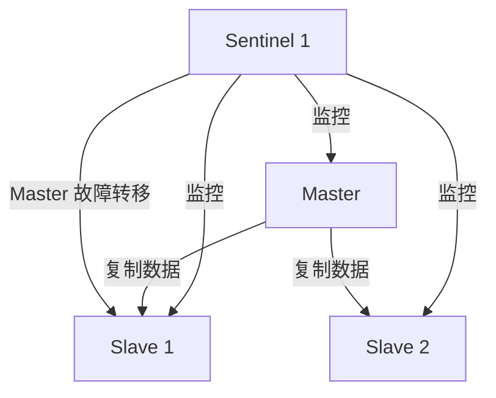
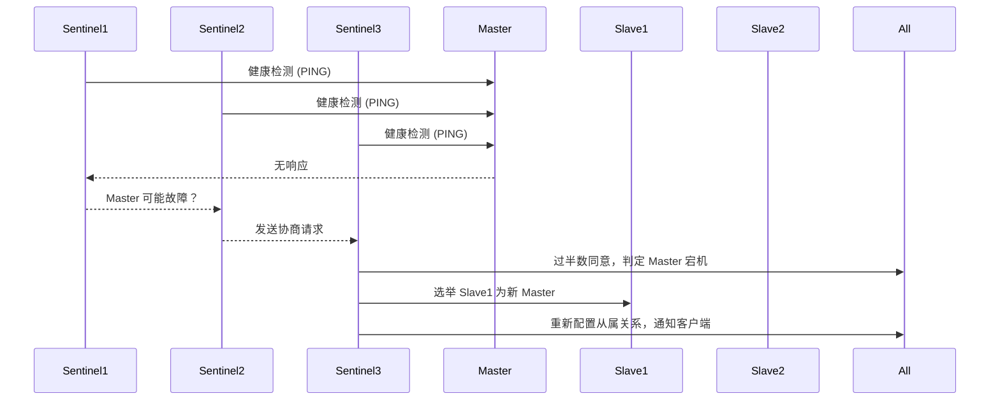
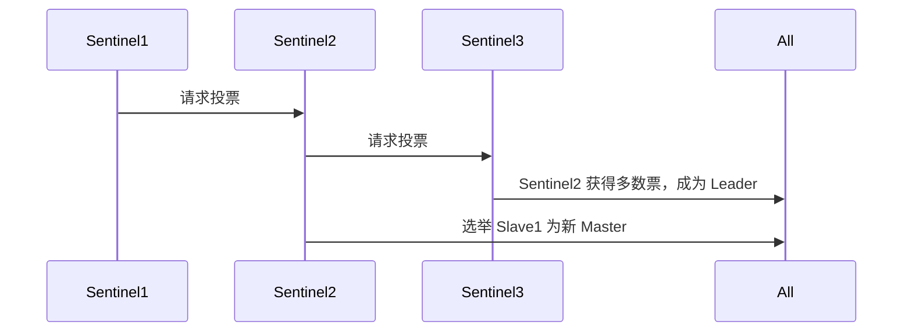
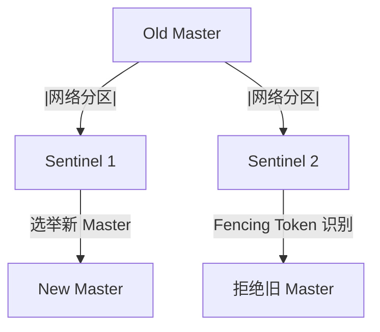

# Redis 哨兵（Sentinel）选举机制详解

## 1. 什么是 Redis 哨兵（Sentinel）？

Redis Sentinel （哨兵模式） 是 Redis 的高可用方案，主要用于 监控主从集群、自动故障转移、提供集群发现服务。

核心功能：

* 主节点（Master）故障检测。
* 自动故障转移（Failover），将 Slave 提升为 Master。
* 通知客户端新 Master 地址，实现透明切换。

## 2. Redis 哨兵架构

组成部分

| 组件           | 作用                       |
| ------------ | ------------------------ |
| Sentinel（哨兵） | 监控 Redis 主从状态，选举新 Master |
| Master（主节点）  | 处理读写请求，数据同步给 Slave       |
| Slave（从节点）   | 仅处理读请求，复制 Master 数据      |



✅ 如果 Master 宕机，Sentinel 选举新的 Master，并通知客户端更新连接地址。

## 3. Redis 哨兵的选举机制

当 Master 宕机，Sentinel 通过 Raft 选举算法 选出新 Master。选举流程如下：

### 选举流程




### 选举步骤

#### 1. Sentinel 定期 PING Master，Master 超时无响应时，Sentinel 标记 Master 为 “主观下线”（Subjectively Down，SDOWN）。

#### 2. 多个 Sentinel 互相通信，若过半数 Sentinel 认定 Master 故障，则进入 “客观下线”（Objectively Down，ODOWN） 状态。

#### 3. Sentinel 选举新的 Master：

* 从存活的 Slave 中选出最新同步的数据节点。
* 将该 Slave 提升为新的 Master。

#### 4. 通知所有 Slave 重新复制新 Master，恢复集群运行。

## 4. 选举新 Master 的规则

当 Sentinel 需要选择新的 Master，它会遵循以下规则：

| 规则           | 说明                           |
| ------------ | ---------------------------- |
| 优先级最高的 Slave | 优先选择 slave-priority 值最低的从节点  |
| 复制进度最新       | 选择复制进度最接近 Master 的 Slave     |
| 响应最快         | 选举过程中响应 Sentinel 请求最快的 Slave |

✅ 配置 Slave 优先级

```shell
slave-priority 1  # 值越小，优先级越高
```

如果多个 Slave 具有相同的优先级，则 Sentinel 选择复制进度最新的 Slave。

## 5. 哨兵选举 Leader

如果有多个 Sentinel 监控同一个 Redis 集群，必须先选出一个 “Sentinel Leader” 来执行故障转移。

📌 Sentinel Leader 选举流程

1\. 每个 Sentinel 互相通信，发现 Master 宕机后，开始选举。

2\. Sentinel 通过 RAFT 算法投票，每个 Sentinel 只能投票一次。

3\. 获得过半数（Quorum）的 Sentinel 当选为 Sentinel Leader。

4\. Leader 负责执行 Master 故障转移。




## 6. 哨兵模式的优缺点

### 优点

* 自动故障转移，无需人工干预。
* 支持主从切换，保证高可用性。
* 可以水平扩展多个 Sentinel，提高稳定性。\


### 缺点

* 仍然是单点写入（Master），写入性能有限。
* 短暂的切换时间（Failover 可能需要 10-30 秒）。
* 可能发生脑裂（Split-Brain），多个 Master 产生数据冲突。

## 7. 解决 Redis Sentinel 的脑裂问题

脑裂（Split-Brain）可能导致 多个 Master 被选出，导致数据不一致。

解决方案：

1. Quorum 多数派投票：至少半数 Sentinel 认为 Master 挂掉，才允许选举。
2. 最小 Slave 选举规则：选择数据最新的 Slave 作为新 Master，避免数据丢失。
3. Fencing Token 机制：使用唯一 Token 限制旧 Master 继续工作，防止数据冲突。




## 8. Redis 哨兵 vs Redis Cluster

| 对比项    | Redis Sentinel   | Redis Cluster    |
| ------ | ---------------- | ---------------- |
| 数据分片   | ❌ 不支持            | ✅ 支持             |
| 主从复制   | ✅ 支持             | ✅ 支持             |
| 自动故障转移 | ✅ 支持             | ✅ 支持             |
| 读写能力   | 单 Master 处理写     | 多 Master 处理写     |
| 适用场景   | 中小型高可用集群（<100GB） | 大规模分布式存储（100GB+） |

✅ 如果数据量小，建议使用 Redis Sentinel；如果数据量大（>100GB），建议 Redis Cluster。

## 9. 总结

🔹 Redis 哨兵模式提供高可用性，通过 监控 + 选举 实现自动故障转移。

🔹 当 Master 发生故障，Sentinel 选举新的 Master，并通知客户端更新连接地址。

🔹 Sentinel 采用 RAFT 算法选举 Leader，确保高效选举并防止脑裂。

🔹 适用于中小型 Redis 集群，但不适用于大规模分布式存储（建议使用 Redis Cluster） 🚀。
