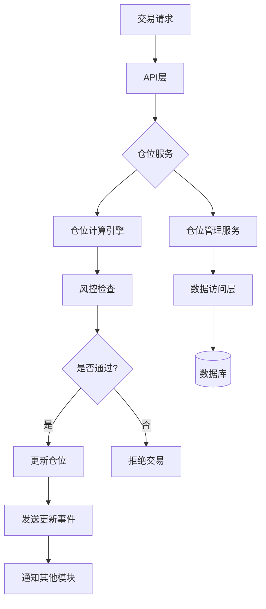
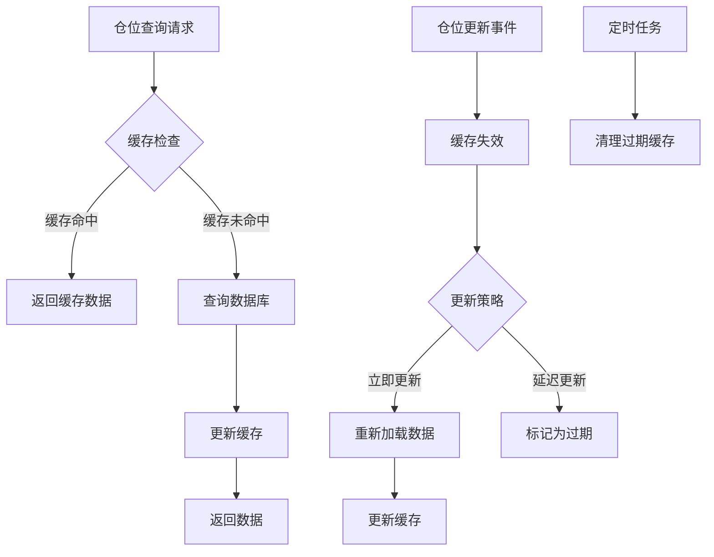
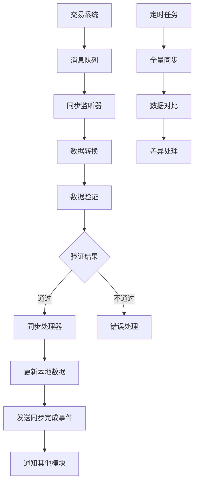
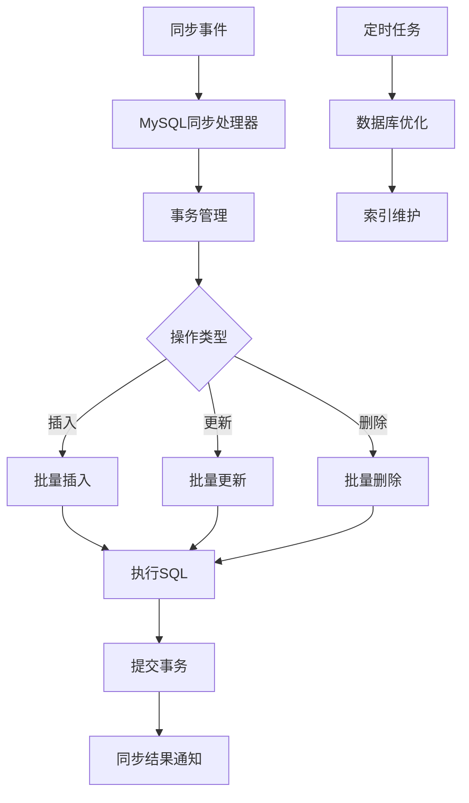
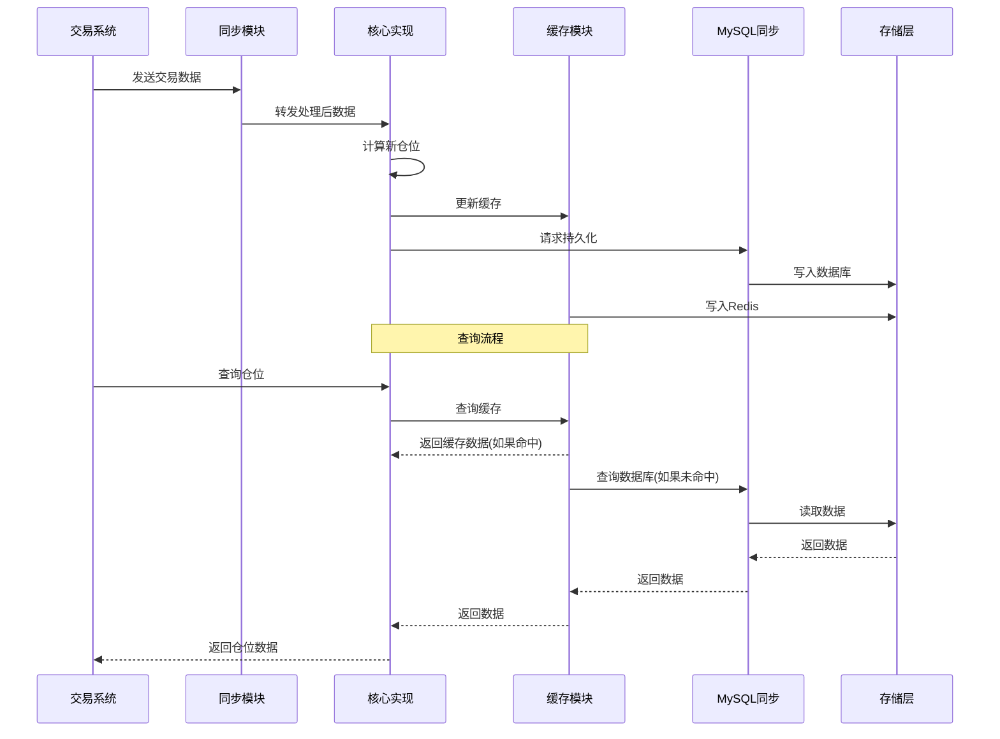

# 仓位逻辑

1.tiger-position-impl 核心实现模块

```mermaid

flowchart TD
    A[交易请求] --> B[API层]
    B --> C{仓位服务}
    C --> D[仓位计算引擎]
    C --> E[仓位管理服务]
    D --> F[风控检查]
    E --> G[数据访问层]
    F --> H{是否通过?}
    H -->|是| I[更新仓位]
    H -->|否| J[拒绝交易]
    I --> K[发送更新事件]
    G --> L[(数据库)]
    K --> M[通知其他模块]

```

2\.

```mermaid
flowchart TD
    A[仓位查询请求] --> B{缓存检查}
    B -->|缓存命中| C[返回缓存数据]
    B -->|缓存未命中| D[查询数据库]
    D --> E[更新缓存]
    E --> F[返回数据]
    G[仓位更新事件] --> H[缓存失效]
    H --> I{更新策略}
    I -->|立即更新| J[重新加载数据]
    I -->|延迟更新| K[标记为过期]
    J --> L[更新缓存]
    M[定时任务] --> N[清理过期缓存]
```

3\.

```mermaid
flowchart TD
    A[交易系统] --> B[消息队列]
    B --> C[同步监听器]
    C --> D[数据转换]
    D --> E[数据验证]
    E --> F{验证结果}
    F -->|通过| G[同步处理器]
    F -->|不通过| H[错误处理]
    G --> I[更新本地数据]
    I --> J[发送同步完成事件]
    J --> K[通知其他模块]
    L[定时任务] --> M[全量同步]
    M --> N[数据对比]
    N --> O[差异处理]
```

4\.

```mermaid
flowchart TD
    A[同步事件] --> B[MySQL同步处理器]
    B --> C[事务管理]
    C --> D{操作类型}
    D -->|插入| E[批量插入]
    D -->|更新| F[批量更新]
    D -->|删除| G[批量删除]
    E --> H[执行SQL]
    F --> H
    G --> H
    H --> I[提交事务]
    I --> J[同步结果通知]
    K[定时任务] --> L[数据库优化]
    L --> M[索引维护]
```

5.模块间数据流关系

```mermaid

sequenceDiagram
    participant 交易系统
    participant tiger-position-sync as 同步模块
    participant tiger-position-impl as 核心实现
    participant tiger-position-cache as 缓存模块
    participant tiger-position-sync-mysql as MySQL同步
    participant 存储层
    
    交易系统->>tiger-position-sync: 发送交易数据
    tiger-position-sync->>tiger-position-impl: 转发处理后数据
    tiger-position-impl->>tiger-position-impl: 计算新仓位
    tiger-position-impl->>tiger-position-cache: 更新缓存
    tiger-position-impl->>tiger-position-sync-mysql: 请求持久化
    tiger-position-sync-mysql->>存储层: 写入数据库
    tiger-position-cache->>存储层: 写入Redis
    
    Note over tiger-position-impl,tiger-position-cache: 查询流程
    
    交易系统->>tiger-position-impl: 查询仓位
    tiger-position-impl->>tiger-position-cache: 查询缓存
    tiger-position-cache-->>tiger-position-impl: 返回缓存数据(如果命中)
    tiger-position-cache->>tiger-position-sync-mysql: 查询数据库(如果未命中)
    tiger-position-sync-mysql->>存储层: 读取数据
    存储层-->>tiger-position-sync-mysql: 返回数据
    tiger-position-sync-mysql-->>tiger-position-cache: 返回数据
    tiger-position-cache-->>tiger-position-impl: 返回数据
    tiger-position-impl-->>交易系统: 返回仓位数据

```

