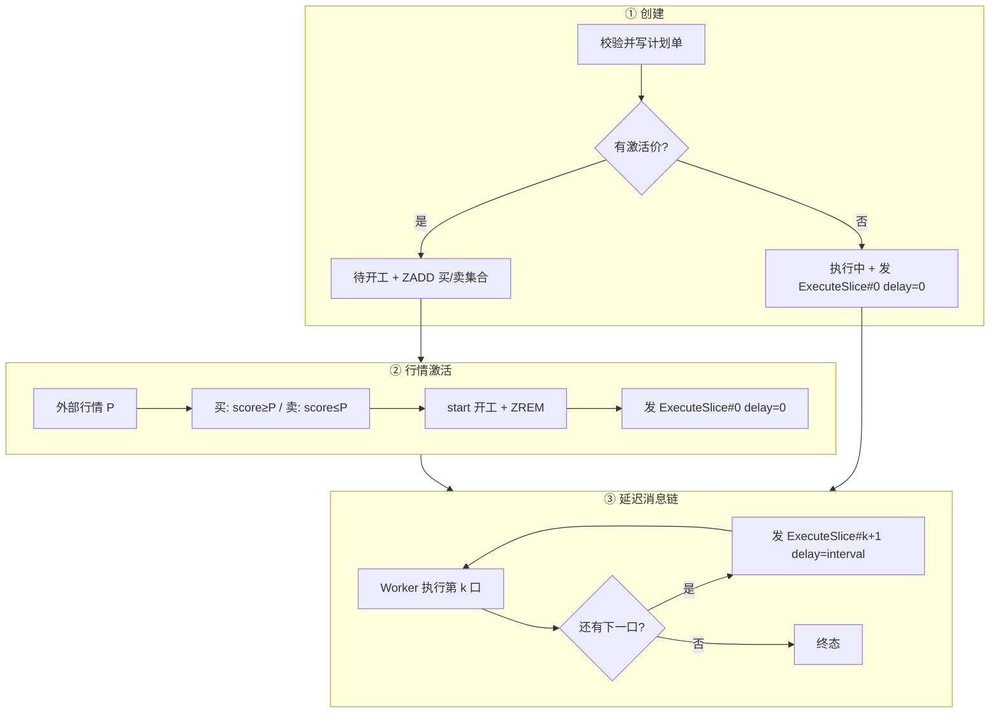

# 高级下单分时

## TWAP 全流程（方案 A：延迟消息链）

下面把**从创建到结束**串成一条线：激活用**有序集合 + 行情**；开工后用**延迟消息链**执行每一口（不单独做调度中心）。

***

### 1. 系统里只有三类东西

| 组件            | 干什么           | 不干什么    |
| ------------- | ------------- | ------- |
| **计划单库**      | 状态、总量、间隔、成交进度 | 不算价、不下单 |
| **有序集合（买/卖）** | 待激活时，按激活价索引   | 不参与拆单   |
| **延迟消息队列**    | 到点执行「第 k 口」   | 不判断激活价  |

推送通知、引擎下单是旁路，不改变主流程。

***

### 2. 消息只有一种（方案 A 的核心）

```
ExecuteSlice {
  planId    // 哪笔 TWAP
  sliceNo   // 第几口：0, 1, 2 …
}
```

投递时带**延迟时间**：

| 场景            | 延迟                 |
| ------------- | ------------------ |
| 开工后第 0 口      | 0（立刻）              |
| 第 k 口做完，还有下一口 | `interval`（如 30 秒） |
| 最后一口做完        | **不再投递**           |

**调度 = 发下一条延迟消息**，没有单独的 Scheduler 进程。

***

### 3. 状态（全流程）

```
待开工  →  执行中  →  终态（成功 / 到期未完成 / 已撤销 / 触限价 / 失败）
   ↑
 创建（有激活价）
   
创建（无激活价）→ 直接 执行中
```

***

### 4. 总览图



***

### 5. 分阶段串流程

#### 阶段 ① 用户创建 TWAP

1. **校验**\
   总量、总时长、间隔（如 10/20/30/60/120 秒）、格数 `N = ⌈时长÷间隔⌉`、单笔最小量、限价与激活价关系等。
2. **写计划单**\
   记下：方向、总量、间隔、激活价、限价、盘口偏移、`tick_total = N` 等。
3.  **分叉**

    | 激活价   | 计划单状态   | 有序集合                     | 延迟消息                                      |
    | ----- | ------- | ------------------------ | ----------------------------------------- |
    | **无** | **执行中** | 不写                       | **立刻发** `ExecuteSlice(planId, 0)` delay=0 |
    | **有** | **待开工** | **ZADD** 买或卖集合，score=激活价 | **不发**                                    |
4. **通知前端**（异步）：订单已创建。
5. **返回** planId。

此阶段不调引擎。

***

#### 阶段 ② 外部行情 → 激活（仅有激活价）

1. **接入**收到：合约、价格类型、价格 `P`。
2. **范围查询**（每个合约、每种价格类型各查两次）
   * 买集合：`score ∈ [P, +∞)` → 激活价 ≥ P 的 planId
   * 卖集合：`score ∈ (-∞, P]` → 激活价 ≤ P 的 planId
3. **积压时**（可选）：短窗口内买用最高价、卖用最低价，只查一次，防漏触发。
4.  **对每个 planId 执行 `start`（幂等）**

    ```
    若状态不是「待开工」→ 跳过
    状态 → 执行中，记录 started_at
    从买/卖集合 ZREM(planId)
    发消息：ExecuteSlice(planId, 0)，delay = 0
    更新计划单：next_slice_no = 0，next_tick_at = now（给恢复用）
    通知：已开始执行
    ```
5. **旁路**：待开工超时（如 24h 未触发）→ 终态「到期」+ ZREM。

**价格逻辑到此结束**；后面不再看激活价。

***

#### 阶段 ③ 延迟消息链执行（方案 A）

**3.1 消费 `ExecuteSlice(planId, k)`**

Worker 每次只做一口：

```
1. 读计划单
   - 非「执行中」→ 直接 return（已撤销/已结束）
   - 幂等：切片表已有 (planId, k) 且已下单 → return

2. 限价检查（若配置了限价）
   - 买：最新价 ≥ 限价 → 终态「触限价」，return
   - 卖：最新价 ≤ 限价 → 同上

3. 算本口数量、本口价格（盘口 ± 偏移）

4. 调引擎 IOC，业务单号幂等：planId + "-" + k

5. 写切片单，累加 filled_qty

6. 通知前端（异步）

7. 决定是否发下一条消息 ★
   if (k + 1 < tick_total) {
       发 ExecuteSlice(planId, k+1)，delay = interval_sec
       更新 next_slice_no = k+1，next_tick_at = now + interval
   } else {
       if (filled_qty >= total_qty) 终态「成功」
       else                         终态「到期未完成」
   }
```

**3.2 时间线例子（间隔 30s，N=60，有激活价）**

```
10:00:00  创建，待开工，进买集合
10:05:00  行情 P 触发 → start → 消息(0, delay=0)
10:05:00  Worker 执行第 0 口 → 消息(1, delay=30s)
10:05:30  Worker 执行第 1 口 → 消息(2, delay=30s)
…
10:34:30  Worker 执行第 59 口 → 不发消息 → 终态
```

任意时刻，队列里这笔单**通常只有 0～1 条**未消费的「下一口」消息。

***

#### 阶段 ④ 用户撤销

```
1. 计划单 → 已撤销
2. ZREM 买/卖集合（若还在待开工）
3. 无法撤回已在 MQ 中的消息时：Worker 第 1 步读状态直接丢弃
4. 撤销引擎上未成交挂单（若有）
5. 通知前端
```

***

#### 阶段 ⑤ 宕机恢复（简单版）

计划单保留：

```
next_slice_no
next_tick_at
status = 执行中
```

定时任务（如每分钟）：

```sql
SELECT id, next_slice_no FROM twap_order
WHERE status = 'RUNNING' AND next_tick_at < NOW()
LIMIT 500
```

对每条**补发**一条 `ExecuteSlice(planId, next_slice_no)` delay=0；\
Worker 幂等，已执行过的口不会重复下单。

***

### 6. 方案 A 在架构里的位置

```
┌─────────────┐     ┌──────────────┐     ┌─────────────────────────┐
│  创建 API    │────►│  计划单 DB    │     │  买/卖 有序集合（仅待激活） │
└─────────────┘     └──────▲───────┘     └───────────┬─────────────┘
                           │                          │
┌─────────────┐            │                          │
│  行情接入    │──范围查────┼──► start ──► 延迟 MQ ──────┤
└─────────────┘            │         ExecuteSlice       │
                           │              │             │
                           │              ▼             │
                           │         ┌─────────┐        │
                           └─────────│ Worker  │◄───────┘
                                     │ 执行一口 │
                                     └────┬────┘
                                          │ 未完成则 ProcessIn(interval)
                                          └──────────► 延迟 MQ（下一口）
```

**MQ 同时承担「调度」和「削峰」**；不需要第二个调度服务。

***

### 7. Java 侧职责划分（落地时）

```
TwapCreateService.create()          // 阶段①
MarketPriceListener.onPrice()       // 阶段②：index.trigger + start
TwapStartService.start()            // 改库 + sliceProducer.send(0, 0)
SliceMessageConsumer.onMessage()    // 阶段③：执行 + sliceProducer.send(k+1, interval)
TwapRecoveryJob.recover()           // 阶段⑤：补发
ActivationIndex                     // TreeMap / Redis ZSET
SliceMessageProducer                // 封装 delay 投递
```

`SliceMessageProducer` 就两行本质：

```java
void sendNow(long planId, int sliceNo) {
    mq.send(new ExecuteSlice(planId, sliceNo), Duration.ZERO);
    updateNextTick(planId, sliceNo, Instant.now());
}

void sendLater(long planId, int sliceNo, int intervalSec) {
    mq.send(new ExecuteSlice(planId, sliceNo), Duration.ofSeconds(intervalSec));
    updateNextTick(planId, sliceNo, Instant.now().plusSeconds(intervalSec));
}
```

***

### 8. 面试口述版（1 分钟）

> TWAP 分两段：**激活**和**执行**。有激活价的待开工订单按合约放进买卖有序集合，行情来了做范围查询，批量开工：改执行中、从集合删掉、发第一条延迟消息执行第 0 口。无激活价则创建后直接发第 0 口。执行采用方案 A：只有一种消息 `ExecuteSlice`，Worker 每次处理一口，做完若还有下一口就再发一条延迟 interval 的消息，形成消息链，不单独做调度中心。计划单上冗余 next\_tick\_at 用于宕机补发。撤销靠状态拦截；限价在每口执行前检查。激活价只决定何时发第一条消息，之后纯时间驱动。

***

### 9. 一张表串完全流程

| 步骤             | 触发     | 计划单           | 有序集合 | 延迟消息                 |
| -------------- | ------ | ------------- | ---- | -------------------- |
| 创建，无激活价        | API    | 执行中           | —    | Send(#0, 0)          |
| 创建，有激活价        | API    | 待开工           | ZADD | —                    |
| 行情到价           | P      | 执行中           | ZREM | Send(#0, 0)          |
| 执行第 k 口        | 消息到期   | 执行中           | —    | 引擎下单                 |
| 第 k 口完成，k+1\<N | Worker | 更新 next\_tick | —    | Send(#k+1, interval) |
| 最后一口完成         | Worker | 终态            | —    | —                    |
| 撤销             | API    | 已撤销           | ZREM | Worker 丢弃            |
| 宕机恢复           | Cron   | 执行中           | —    | 补发 Send(#next, 0)    |

***

这就是**方案 A 下的完整流程**：有序集合管「何时发第一条消息」；之后全靠**延迟消息链**一口接一口，直到结束。若你要落文档，可以把 §5 + §9 当作设计说明里的「主流程」章节直接贴进去。
