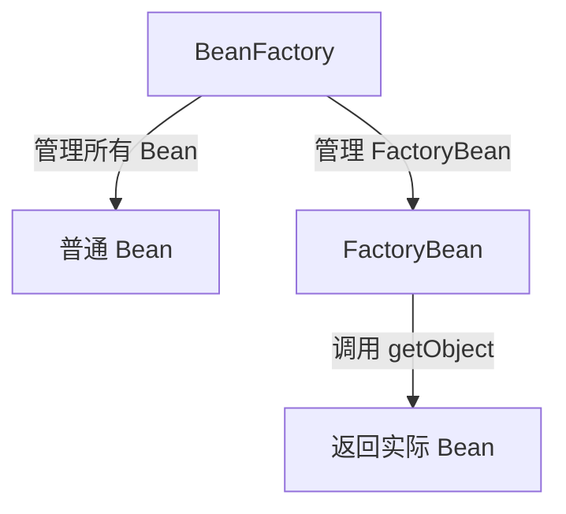

# BeanFactory 与 FactoryBean 的关系

## 1. BeanFactory 是什么？

BeanFactory 是 Spring 的 IoC 容器，用于 管理 Bean 的创建、初始化、依赖注入和生命周期。java

BeanFactory 的核心方法

```java
public interface BeanFactory {
    Object getBean(String name); // 获取 Bean
    <T> T getBean(Class<T> requiredType); // 根据类型获取 Bean
}
```

关键点

* BeanFactory 是 Spring 容器的最底层接口，负责 管理 Bean 的生命周期。
* ApplicationContext 继承自 BeanFactory，并增强了更多功能（如事件机制、国际化支持）。

## 2. FactoryBean 是什么？

FactoryBean\<T> 是 一个特殊的 Bean，专门用于创建复杂 Bean。java

FactoryBean 的核心方法

```java
public interface FactoryBean<T> {
    T getObject() throws Exception; // 返回 Bean 实例
    Class<?> getObjectType(); // 返回 Bean 类型
    boolean isSingleton(); // 是否单例
}
```

关键点

* FactoryBean\<T> 本身是一个 Bean，但它 返回的不是 FactoryBean 自己，而是 getObject() 方法返回的 Bean。
*   可以用于创建复杂的 Bean，如 代理对象、动态生成的 Bean。


## 3. BeanFactory 与 FactoryBean 的关系

* BeanFactory 是 Spring 的 IoC 容器，负责 管理所有 Bean 的生命周期。
* FactoryBean 是一个 Bean，但它 不直接返回自己，而是 getObject() 返回的对象。
*   在 BeanFactory 中，FactoryBean 用于创建特殊 Bean，Spring 通过 FactoryBean 获取真正的 Bean 实例。




## 4. FactoryBean 示例

### 4.1 自定义 FactoryBean

```java
import org.springframework.beans.factory.FactoryBean;
import org.springframework.stereotype.Component;

@Component
public class MyFactoryBean implements FactoryBean<MyBean> {

    @Override
    public MyBean getObject() throws Exception {
        return new MyBean("工厂创建的 Bean");
    }

    @Override
    public Class<?> getObjectType() {
        return MyBean.class;
    }

    @Override
    public boolean isSingleton() {
        return true;
    }
}
```

```java
public class MyBean {
    private String name;

    public MyBean(String name) {
        this.name = name;
    }

    public String getName() {
        return name;
    }
}
```

### 4.2 测试 FactoryBean

```java
import org.springframework.context.ApplicationContext;
import org.springframework.context.annotation.AnnotationConfigApplicationContext;

public class FactoryBeanTest {
    public static void main(String[] args) throws Exception {
        ApplicationContext context = new AnnotationConfigApplicationContext(AppConfig.class);

        // 获取 FactoryBean 生成的 Bean（MyBean 实例）
        MyBean myBean = (MyBean) context.getBean("myFactoryBean");
        System.out.println("FactoryBean 生成的 Bean: " + myBean.getName());

        // 获取 FactoryBean 自身（注意 `&` 前缀）
        MyFactoryBean factoryBean = (MyFactoryBean) context.getBean("&myFactoryBean");
        System.out.println("FactoryBean 自身: " + factoryBean);
    }
}
```

执行结果

```java
FactoryBean 生成的 Bean: 工厂创建的 Bean
FactoryBean 自身: com.example.MyFactoryBean@xxxx
```

关键点

* context.getBean("myFactoryBean") 获取的是 getObject() 返回的 Bean。
* context.getBean("\&myFactoryBean") 获取的是 FactoryBean 本身。

## 5. BeanFactory vs. FactoryBean

| 对比项               | BeanFactory         | FactoryBean                  |
| ----------------- | ------------------- | ---------------------------- |
| 定义                | Spring IoC 容器       | 特殊 Bean，用于创建复杂对象             |
| 作用                | 管理所有 Bean 的生命周期     | 创建 Bean 并返回 getObject()      |
| 返回对象              | 普通 Bean             | getObject() 返回的 Bean         |
| 是否是 Bean          | ❌ 不是 Bean           | ✅ 是 Bean                     |
| 如何获取              | getBean("beanName") | getBean("factoryBeanName")   |
| 获取 FactoryBean 本身 | ❌ 不适用               | getBean("\&factoryBeanName") |
| 应用场景              | 负责管理 Bean           | 创建代理对象、动态生成 Bean             |

## 6. 结论

* BeanFactory 是 Spring 容器的最底层接口，用于 管理所有 Bean 的生命周期。
* FactoryBean 本身是一个 Bean，但它 返回的是 getObject() 生成的 Bean。
* BeanFactory 负责管理 FactoryBean，Spring 通过 FactoryBean 生成复杂 Bean。
* FactoryBean 适用于 需要 动态创建对象（如代理对象、数据库连接） 的场景。&#x20;
