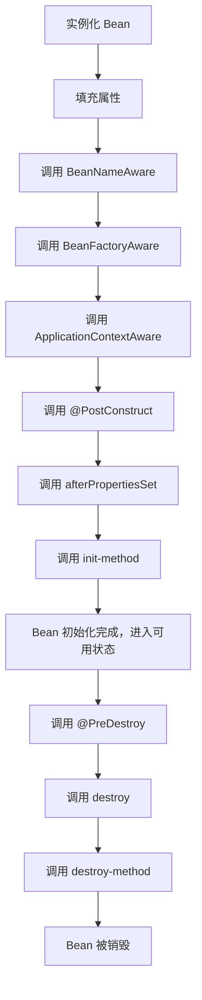

# Spring Bean 的生命周期详细讲解

本文将详细解析 Spring Bean 生命周期，并提供 源码解析、生命周期流程图和示例代码。

## 1. Spring Bean 的生命周期流程

Spring Bean 生命周期主要包括以下阶段：

1\. 实例化（Instantiation）：Spring 创建 Bean 实例（new）。

2\. 填充属性（Populate Properties）：设置 Bean 的依赖（从 @Autowired 或 XML 解析）。

3\. BeanNameAware：如果实现了 BeanNameAware，Spring 传入 Bean 的名字。

4\. BeanFactoryAware：如果实现了 BeanFactoryAware，Spring 传入 BeanFactory。

5\. ApplicationContextAware：如果实现了 ApplicationContextAware，Spring 传入 ApplicationContext。

6\. @PostConstruct 方法调用（初始化前）。

7\. InitializingBean#afterPropertiesSet() 调用（Bean 初始化）。

8\. init-method 调用（XML 或 @Bean(initMethod)）（Bean 初始化）。

9\. Bean 完成初始化，进入可用状态。

10\. @PreDestroy 方法调用（Bean 销毁前）。

11\. DisposableBean#destroy() 调用（Bean 销毁）。

12\. destroy-method 调用（XML 或 @Bean(destroyMethod)）（Bean 销毁）。




## 2. Bean 生命周期的核心方法解析

### 2.1 实例化（Instantiation）

Spring 通过反射创建 Bean 实例：

```java
public Object createBeanInstance() {
    return new MyBean(); // 反射方式创建 Bean
}
```

📌 关键点：Spring 解析 XML 配置或 @Component 扫描后，通过 反射 实例化 Bean。

### 2.2 依赖注入（Populate Properties）

Spring 解析 @Autowired、构造函数注入、setter 注入：

```
public void populateBean() {
    bean.setDependency(dependency);
}
```

📌 关键点：Spring 解析 @Autowired，自动注入所需依赖。

### 2.3 BeanNameAware（获取 Bean 名称）

如果 Bean 实现了 BeanNameAware，Spring 回调 setBeanName() 传入 Bean 名称：

```java
public class MyBean implements BeanNameAware {
    @Override
    public void setBeanName(String name) {
        System.out.println("Bean Name: " + name);
    }
}
```

📌 关键点：用于 在 Bean 初始化前获取 Bean 名称。

### 2.4 BeanFactoryAware（获取 BeanFactory） 

如果 Bean 实现了 BeanFactoryAware，Spring 回调 setBeanFactory() 传入 BeanFactory：

```java
public class MyBean implements BeanFactoryAware {
    @Override
    public void setBeanFactory(BeanFactory beanFactory) {
        System.out.println("BeanFactory 传入");
    }
}
```

📌 关键点：用于 访问 Spring 容器的 BeanFactory，动态获取 Bean。

### 2.5 ApplicationContextAware（获取 ApplicationContext）

如果 Bean 实现了 ApplicationContextAware，Spring 回调 setApplicationContext() 传入 ApplicationContext：

```java
public class MyBean implements ApplicationContextAware {
    @Override
    public void setApplicationContext(ApplicationContext applicationContext) {
        System.out.println("ApplicationContext 传入");
    }
}
```

📌 关键点：用于 访问 Spring 容器的 ApplicationContext，可以手动获取其他 Bean。

### 2.6 @PostConstruct（初始化前）

Spring 调用 @PostConstruct 标注的方法：

```java
@Component
public class MyBean {
    @PostConstruct
    public void initMethod() {
        System.out.println("PostConstruct 初始化");
    }
}
```

📌 关键点：优先于 afterPropertiesSet() 执行，用于 初始化逻辑。

### 2.7 InitializingBean#afterPropertiesSet()

如果 Bean 实现了 InitializingBean，Spring 调用 afterPropertiesSet()：

```java
public class MyBean implements InitializingBean {
    @Override
    public void afterPropertiesSet() {
        System.out.println("afterPropertiesSet 初始化");
    }
}
```

📌 关键点：在 @PostConstruct 之后执行，用于 检查 Bean 配置。

### 2.8 init-method

如果 Bean 在 XML 或 @Bean(initMethod) 配置了 init-method，Spring 调用此方法：

```java
@Bean(initMethod = "init")
public MyBean myBean() {
    return new MyBean();
}

public class MyBean {
    public void init() {
        System.out.println("init-method 初始化");
    }
}
```

📌 关键点：在 afterPropertiesSet() 之后执行。

### 2.9 @PreDestroy（销毁前）

Spring 调用 @PreDestroy 标注的方法：

```java
@Component
public class MyBean {
    @PreDestroy
    public void destroyMethod() {
        System.out.println("PreDestroy 销毁");
    }
}
```

📌 关键点：在 Bean 被销毁前调用，用于 释放资源。

### 2.10 DisposableBean#destroy()

如果 Bean 实现了 DisposableBean，Spring 调用 destroy()：

```java
public class MyBean implements DisposableBean {
    @Override
    public void destroy() {
        System.out.println("DisposableBean 销毁");
    }
}
```

📌 关键点：在 @PreDestroy 之后执行，用于 释放 Bean 相关资源。

### 2.11 destroy-method

如果 Bean 在 XML 或 @Bean(destroyMethod) 配置了 destroy-method，Spring 调用此方法：

```java
@Bean(destroyMethod = "destroy")
public MyBean myBean() {
    return new MyBean();
}

public class MyBean {
    public void destroy() {
        System.out.println("destroy-method 销毁");
    }
}
```

📌 关键点：在 destroy() 之后执行。

## 3. Spring Bean 生命周期示例

```java
import org.springframework.beans.factory.DisposableBean;
import org.springframework.beans.factory.InitializingBean;
import org.springframework.context.annotation.*;

import javax.annotation.PostConstruct;
import javax.annotation.PreDestroy;

@Component
public class MyBean implements InitializingBean, DisposableBean {

    @PostConstruct
    public void postConstruct() {
        System.out.println("@PostConstruct 初始化");
    }

    @Override
    public void afterPropertiesSet() {
        System.out.println("afterPropertiesSet 初始化");
    }

    public void init() {
        System.out.println("init-method 初始化");
    }

    @PreDestroy
    public void preDestroy() {
        System.out.println("@PreDestroy 销毁");
    }

    @Override
    public void destroy() {
        System.out.println("destroy() 销毁");
    }
}

@Configuration
@ComponentScan
class AppConfig {}

public class Main {
    public static void main(String[] args) {
        AnnotationConfigApplicationContext context = new AnnotationConfigApplicationContext(AppConfig.class);
        context.close();
    }
}
```

执行结果

```
@PostConstruct 初始化
afterPropertiesSet 初始化
init-method 初始化
@PreDestroy 销毁
destroy() 销毁
```

## 4. 总结

* Spring Bean 生命周期包含创建、初始化、使用、销毁阶段。
* 支持 @PostConstruct、afterPropertiesSet()、init-method 进行初始化。
* 支持 @PreDestroy、destroy()、destroy-method 进行销毁。
* 推荐使用 @PostConstruct 和 @PreDestroy，避免 InitializingBean & DisposableBean 侵入代码 。
