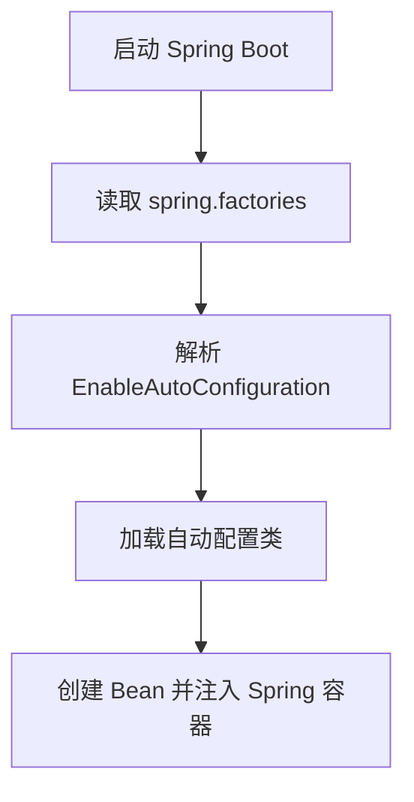
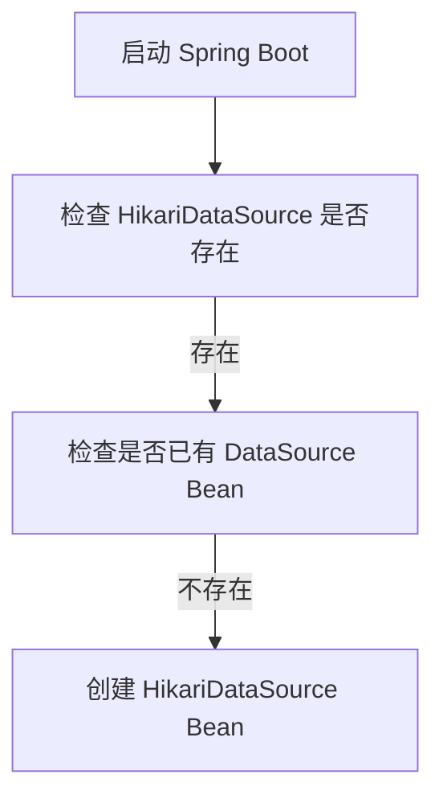

# Spring Boot 自动装配原理（AutoConfiguration）

## 1. 什么是 Spring Boot 自动装配？

## 1.1 传统 Spring 配置

在 Spring 传统项目中，需要手动配置 XML 或 Java 配置：

```java
<bean id="dataSource" class="com.zaxxer.hikari.HikariDataSource">
    <property name="jdbcUrl" value="jdbc:mysql://localhost:3306/test"/>
</bean>
```

或者：

```java
@Bean
public DataSource dataSource() {
    return new HikariDataSource();
}
```

⚠️ 问题：配置繁琐，维护成本高。

## 1.2 Spring Boot 自动装配

Spring Boot 基于 @EnableAutoConfiguration 自动配置 Bean，无需手动配置：

```java
@SpringBootApplication // 包含 @EnableAutoConfiguration
public class MyApplication {
    public static void main(String[] args) {
        SpringApplication.run(MyApplication.class, args);
    }
}
```

自动装配：Spring Boot 根据 classpath 依赖和配置，自动创建合适的 Bean。

## 2. Spring Boot 自动装配的核心逻辑

### 2.1 @SpringBootApplication 解析

```java
@Target(ElementType.TYPE)
@Retention(RetentionPolicy.RUNTIME)
@Documented
@Inherited
@SpringBootConfiguration
@EnableAutoConfiguration // 关键注解
@ComponentScan(excludeFilters = @Filter(type = FilterType.CUSTOM, classes = TypeExcludeFilter.class))
public @interface SpringBootApplication {
}
```

&#x20;@EnableAutoConfiguration 是核心，它启用了自动装配。

### 2.2 @EnableAutoConfiguration

```
@Target(ElementType.TYPE)
@Retention(RetentionPolicy.RUNTIME)
@Documented
@Inherited
@AutoConfigurationPackage
@Import(AutoConfigurationImportSelector.class) // 关键：导入自动配置类
public @interface EnableAutoConfiguration {
}
```

@EnableAutoConfiguration 作用

* @AutoConfigurationPackage：自动注册 当前包及子包 下的组件。
* @Import(AutoConfigurationImportSelector.class)：加载自动配置类。

### 2.3 AutoConfigurationImportSelector 核心逻辑

```java
@Override
public String[] selectImports(AnnotationMetadata annotationMetadata) {
    return getAutoConfigurationEntry(annotationMetadata).toArray(new String[0]);
}
```

核心逻辑

1. 获取 META-INF/spring.factories（存放自动配置类）。
2. 解析所有 EnableAutoConfiguration 配置项。
3. 返回自动配置类列表，并交由 Spring 容器管理。



## 3. spring.factories 配置

Spring Boot 通过 spring.factories 文件 加载自动配置类：

```
org.springframework.boot.autoconfigure.EnableAutoConfiguration=\
org.springframework.boot.autoconfigure.jdbc.DataSourceAutoConfiguration,\
org.springframework.boot.autoconfigure.web.servlet.WebMvcAutoConfiguration
```

spring.factories 告诉 Spring Boot 需要加载哪些自动配置类。

## 4. 自动装配的源码解析

### 4.1 DataSourceAutoConfiguration 示例

```java
@Configuration(proxyBeanMethods = false)
@EnableConfigurationProperties(DataSourceProperties.class)
@ConditionalOnClass(HikariDataSource.class) // 依赖 HikariCP
@ConditionalOnMissingBean(DataSource.class) // 没有手动配置 DataSource 才加载
public class DataSourceAutoConfiguration {

    @Bean
    @ConditionalOnMissingBean
    public DataSource dataSource(DataSourceProperties properties) {
        HikariDataSource dataSource = new HikariDataSource();
        dataSource.setJdbcUrl(properties.getUrl());
        dataSource.setUsername(properties.getUsername());
        dataSource.setPassword(properties.getPassword());
        return dataSource;
    }
}
```

DataSourceAutoConfiguration 逻辑

• 如果 classpath 有 HikariDataSource，且没有手动配置 DataSource，则自动创建 Hikari 连接池。



### 4.2 @Conditional 相关注解

| 注解                         | 作用                                          |
| -------------------------- | ------------------------------------------- |
| @ConditionalOnClass        | 类存在时自动装配（如 HikariCP 存在时装配 HikariDataSource） |
| @ConditionalOnMissingClass | 类不存在时自动装配                                   |
| @ConditionalOnBean         | Bean 存在时自动装配                                |
| @ConditionalOnMissingBean  | Bean 不存在时自动装配                               |
| @ConditionalOnProperty     | 配置项匹配时自动装配（如 server.port=8080）              |
| @ConditionalOnExpression   | SpEL 表达式匹配时装配                               |
| @ConditionalOnJava         | 特定 Java 版本时装配                               |

## 5. 自定义自动装配

### 5.1 创建 META-INF/spring.factories

```java
org.springframework.boot.autoconfigure.EnableAutoConfiguration=com.example.MyAutoConfiguration
```

### 5.2 编写 MyAutoConfiguration

```java
@Configuration
@ConditionalOnClass(MyService.class) // 只有 MyService 存在时才装配
public class MyAutoConfiguration {
    
    @Bean
    @ConditionalOnMissingBean
    public MyService myService() {
        return new MyService();
    }
}
```

MyAutoConfiguration 作用

* 当 MyService 存在时自动配置 MyService Bean。

## 6. 总结

* &#x20;Spring Boot 通过 @EnableAutoConfiguration 自动装配 Bean。
* spring.factories 配置了所有自动装配类。
* @Conditional 注解决定是否执行自动配置（如类存在/配置匹配时才生效）。
* AutoConfigurationImportSelector 解析 spring.factories 并注册配置类。
* 可以自定义自动装配（创建 spring.factories + @Configuration）。 🚀
