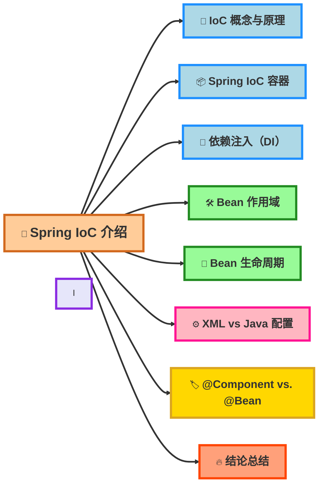
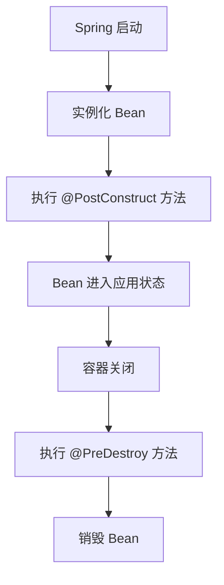

# Spring IOC



## 1.IOC 概念与原理

IoC（Inversion of Control，控制反转）是一种 设计思想，它将<mark style="color:red;">对象创建和依赖管理</mark>的控制权交给 Spring 框架，而不是由开发者在代码中 new 实例。

### 传统开发 vs. IoC

传统方式

```java
class UserService {
    private UserRepository userRepository = new UserRepository(); // 直接 new
}
```

**问题**：

* 耦合度高：UserService 强依赖 UserRepository，难以更换实现。
* 不利于单元测试：无法轻松 Mock UserRepository。

IoC 方式

```java
@Component
class UserRepository {}

@Service
class UserService {
    private final UserRepository userRepository;

    @Autowired
    public UserService(UserRepository userRepository) {
        this.userRepository = userRepository; // 依赖注入
    }
}
```

**优势:**

* Spring 容器管理对象，不再手动 new
* 组件可插拔，可以轻松替换 UserRepository 的实现
* 更易测试，可以在测试时 Mock 依赖。

## 2.Spring IoC 容器

Spring IoC 容器是 负责管理 Bean 依赖关系 的核心组件，主要有两种实现：

| IoC 容器             | 接口                 | 特点                  |
| ------------------ | ------------------ | ------------------- |
| BeanFactory        | BeanFactory        | 轻量级，延迟初始化，适用于资源受限环境 |
| ApplicationContext | ApplicationContext | 增强版，支持事件监听、国际化，推荐使用 |

大多数情况下使用 ApplicationContext 而不是 BeanFactory。


## 3.依赖注入（DI，Dependency Injection）

Spring **支持 3 种依赖注入方式：**

### 1. 构造器注入（推荐 ✅）

```java
@Component
class UserService {
    private final UserRepository userRepository;

    @Autowired
    public UserService(UserRepository userRepository) {
        this.userRepository = userRepository;
    }
}
```

### 2.Setter 注入

```
 @Component
class UserService {
    private UserRepository userRepository;

    @Autowired
    public void setUserRepository(UserRepository userRepository) {
        this.userRepository = userRepository;
    }
}
```

### 3.字段注入（不推荐 ❌）

```java
@Component
class UserService {
    @Autowired
    private UserRepository userRepository;
}
```

## 4.Spring Bean 作用域

Spring 允许开发者控制 Bean 的作用域（Scope），以决定 Bean 在容器中的生命周期和创建策略。Spring 提供了 5 种主要作用域，适用于不同的场景。

| 作用域      | 关键字                     | 描述                           | 适用场景                         |
| -------- | ----------------------- | ---------------------------- | ---------------------------- |
| 单例模式（默认） | @Scope("singleton")     | 整个 Spring 容器 只创建 一个实例，所有请求共享 | 大多数服务类（如 Service、Repository） |
| 原型模式     | @Scope("prototype")     | 每次获取时 都创建 新的实例               | 需要每次调用都创建新对象（如任务处理类）         |
| 请求作用域    | @Scope("request")       | 每个 HTTP 请求 创建一个实例            | Web 应用（每个请求独立对象）             |
| 会话作用域    | @Scope("session")       | 每个 HTTP 会话（Session） 共享一个实例   | 存储用户登录状态的 Bean               |
| 全局会话作用域  | @Scope("globalSession") | 全局 Session 级别共享              | Portlet 环境（很少用）              |

## 5.Spring Bean 生命周期



## 6.XML vs. Java 配置

### 不推荐 XML 配置

```xml
<bean id="userService" class="com.example.UserService">
    <constructor-arg ref="userRepository"/>
</bean>
```

### 推荐 Java 配置

```xml
@Configuration
public class AppConfig {
    @Bean
    public UserService userService(UserRepository userRepository) {
        return new UserService(userRepository);
    }
}
```

## 7.总结

Spring IoC 让容器管理对象的创建、依赖和生命周期，减少手动创建对象的耦合，提高系统的可维护性和测试性。

为了让依赖关系更加清晰，我们推荐使用 构造器注入（DI），这样可以确保对象在创建时就满足所有依赖，避免维护困扰。

同时，Bean 的生命周期和作用域是 IoC 机制中至关重要的部分。合理管理生命周期可以避免资源浪费，而正确的作用域设置可以提高应用的性能和稳定性。

为了让配置更简洁和可维护，我们应该优先使用 Java 配置（@Configuration + @Bean），避免 XML 过于冗长和难以管理，从而提高开发效率和类型安全性。


