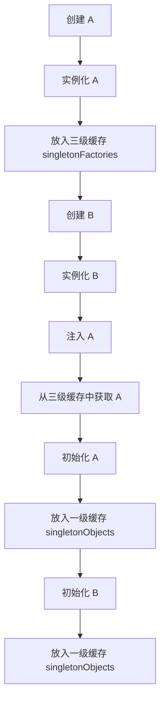

# Spring 如何解决循环依赖（Circular Dependency）

Spring 主要通过 “三级缓存” 解决循环依赖问题，本文将详细解析 循环依赖的类型、Spring 解决方案、三级缓存源码解析和示例代码。

## 1. 什么是循环依赖？

### 1.1 循环依赖的类型

#### 1.构造方法循环依赖（无解❌）

* 两个 Bean 互相通过构造函数依赖，Spring 无法解决。&#x20;

#### 2. Setter 方式循环依赖（可解决 ✅）

* 两个 Bean 通过 @Autowired 或 setXxx() 互相注入，Spring 可以通过三级缓存解决。

#### 2. 三级缓存的工作原理

Spring 通过 “三级缓存” 解决 Setter 方式循环依赖：

* singletonObjects（一级缓存）：存放完全初始化的单例 Bean。
* earlySingletonObjects（二级缓存）：存放早期暴露的 Bean 实例（未填充属性）。
* singletonFactories（三级缓存）：存放 Bean 实例工厂，用于生成 Bean 实例。



## 3. Spring 三级缓存源码解析

### 3.1 getSingleton() 方法（核心入口）

```java
public Object getSingleton(String beanName, boolean allowEarlyReference) {
    Object singleton = singletonObjects.get(beanName); // 1️⃣ 从一级缓存获取 Bean
    if (singleton == null && isSingletonCurrentlyInCreation(beanName)) {
        synchronized (this.singletonObjects) {
            singleton = earlySingletonObjects.get(beanName); // 2️⃣ 从二级缓存获取 Bean
            if (singleton == null && allowEarlyReference) {
                ObjectFactory<?> singletonFactory = singletonFactories.get(beanName);
                if (singletonFactory != null) {
                    singleton = singletonFactory.getObject(); // 3️⃣ 通过三级缓存创建 Bean
                    earlySingletonObjects.put(beanName, singleton); // 4️⃣ 存入二级缓存
                    singletonFactories.remove(beanName); // 5️⃣ 移除三级缓存
                }
            }
        }
    }
    return singleton;
}
```

**关键点**

1. 先查一级缓存 singletonObjects，如果 Bean 已经完全初始化，直接返回。
2. 再查二级缓存 earlySingletonObjects，用于存放提前暴露的 Bean。
3. 最后查三级缓存 singletonFactories，如果 Bean 还未创建，则从三级缓存中获取并实例化，然后放入二级缓存。

### 3.2 addSingletonFactory() 方法（提前暴露 Bean）

```
protected void addSingletonFactory(String beanName, ObjectFactory<?> singletonFactory) {
    synchronized (this.singletonObjects) {
        if (!this.singletonObjects.containsKey(beanName)) {
            this.singletonFactories.put(beanName, singletonFactory); // 三级缓存
            this.earlySingletonObjects.remove(beanName);
        }
    }
}
```

关键点

* 先将 Bean 工厂放入三级缓存，等后续需要时再获取并创建 Bean。

### 3.3 createBeanInstance() 方法

```java
protected Object createBeanInstance(String beanName, RootBeanDefinition mbd, Object[] args) {
    Object beanInstance = new MyBean(); // 1️⃣ 反射创建 Bean 实例
    addSingletonFactory(beanName, () -> getEarlyBeanReference(beanName, mbd, beanInstance)); // 2️⃣ 提前暴露 Bean
    return beanInstance;
}
```

关键点

* 创建 Bean 实例后，立即将 Bean 工厂放入三级缓存，以便后续使用。

## 4. Spring 解决循环依赖示例

### 4.1 构造方法循环依赖（Spring 无法解决）

```java
@Component
public class A {
    private final B b;
    public A(B b) { this.b = b; }
}

@Component
public class B {
    private final A a;
    public B(A a) { this.a = a; }
}

@Configuration
@ComponentScan
class AppConfig {}

public class Main {
    public static void main(String[] args) {
        new AnnotationConfigApplicationContext(AppConfig.class); // 运行报错
    }
}
```

错误

```
BeanCurrentlyInCreationException: Requested bean is currently in creation
```

关键点

* Spring 无法解决构造方法循环依赖，因为 A 需要 B，而 B 也需要 A，导致无法完成实例化。

### 4.2 @Autowired Setter 方式循环依赖（Spring 可以解决 ✅）

```java
@Component
public class A {
    private B b;

    @Autowired
    public void setB(B b) { this.b = b; }
}

@Component
public class B {
    private A a;

    @Autowired
    public void setA(A a) { this.a = a; }
}

@Configuration
@ComponentScan
class AppConfig {}

public class Main {
    public static void main(String[] args) {
        new AnnotationConfigApplicationContext(AppConfig.class);
        System.out.println("Spring 成功解决 Setter 方式循环依赖");
    }
}
```

执行结果

```
Spring 成功解决 Setter 方式循环依赖
```

关键点

* Spring 通过三级缓存提前暴露 Bean，解决 Setter 循环依赖。

### 4.3 @Lazy 解决循环依赖

使用 @Lazy 让 Spring 延迟初始化某个 Bean，避免循环依赖：

```java
@Component
public class A {
    private final B b;

    @Autowired
    public A(@Lazy B b) { this.b = b; }
}

@Component
public class B {
    private final A a;

    @Autowired
    public B(A a) { this.a = a; }
}
```

关键点

* @Lazy 让 B 在 A 创建完后再初始化，避免循环依赖问题。

### 4.4 使用 ObjectFactory 解决循环依赖

```java
@Component
public class A {
    private final ObjectFactory<B> bFactory;

    @Autowired
    public A(ObjectFactory<B> bFactory) { this.bFactory = bFactory; }

    public void useB() {
        B b = bFactory.getObject(); // 延迟获取 B
        System.out.println("使用 B: " + b);
    }
}
```

关键点

* ObjectFactory\<B> 延迟获取 Bean，避免循环依赖。

## 5. 总结

* Spring 通过三级缓存（singletonObjects、earlySingletonObjects、singletonFactories）解决 Setter 方式循环依赖。
* 构造方法循环依赖无法解决，可以使用 @Lazy 或 ObjectFactory\<B> 避免。
* @Lazy & ObjectFactory\<B> 可以用于手动优化 Bean 依赖，减少循环引用风险。
