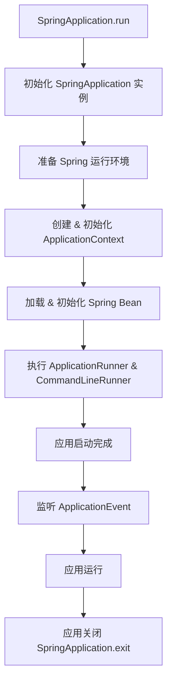
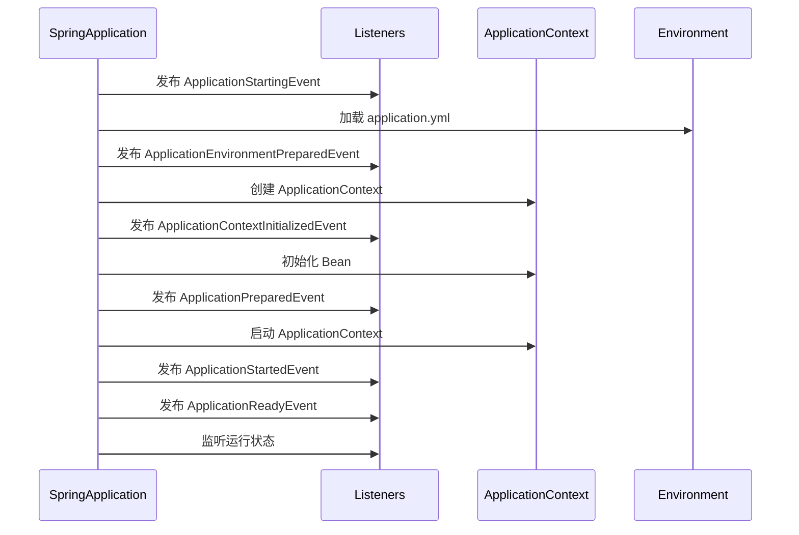

# SpringApplication 生命周期详解

## 1. SpringApplication 生命周期概述

Spring Boot 通过 SpringApplication.run() 启动应用，其生命周期主要包括：

1\. 实例化 SpringApplication（构造方法）

2\. 运行 run() 方法，执行 启动流程

* 准备环境（Environment）
* 应用上下文初始化（ApplicationContext）
* Spring Bean 加载
* 应用启动

3\. 监听 ApplicationEvent 事件

4\. 应用关闭（SpringApplication.exit()）

2\. SpringApplication 生命周期流程



## 3. SpringApplication 生命周期源码解析

### 3.1 SpringApplication.run() 源码

```java
public ConfigurableApplicationContext run(String... args) {
    long startTime = System.currentTimeMillis();
    
    // 1️⃣ 创建并启动 `SpringApplicationRunListeners` 监听器
    SpringApplicationRunListeners listeners = getRunListeners(args);
    listeners.starting();

    // 2️⃣ 准备 `Environment`
    ConfigurableEnvironment environment = prepareEnvironment(listeners, args);

    // 3️⃣ 创建 `ApplicationContext`
    ConfigurableApplicationContext context = createApplicationContext();

    // 4️⃣ 预初始化 `ApplicationContext`
    prepareContext(context, environment, listeners, args);

    // 5️⃣ 刷新 `ApplicationContext`（加载所有 Bean）
    refreshContext(context);

    // 6️⃣ 执行 `ApplicationRunner` & `CommandLineRunner`
    afterRefresh(context, args);

    // 7️⃣ 通知 `ApplicationEvent` 监听器
    listeners.running(context);

    return context;
}
```

核心流程

1. 创建 SpringApplicationRunListeners，触发 starting() 事件
2. 准备 Environment（加载 application.yml、系统环境变量）
3. 创建 ApplicationContext（Spring 容器）
4. 初始化 ApplicationContext
5. refreshContext() 加载 Spring Bean
6. 执行 ApplicationRunner & CommandLineRunner
7. 发布 running 事件

## 4. SpringApplication 生命周期中的核心事件

| 事件                                  | 触发时机                    | 作用                                       |
| ----------------------------------- | ----------------------- | ---------------------------------------- |
| ApplicationStartingEvent            | 应用启动时（第一步）              | 通知监听器，应用正在启动                             |
| ApplicationEnvironmentPreparedEvent | 环境初始化完成                 | 配置 Environment（加载 application.yml）       |
| ApplicationContextInitializedEvent  | ApplicationContext 创建完成 | 初始化 ApplicationContext                   |
| ApplicationPreparedEvent            | Bean 加载前                | ApplicationContext 预初始化                  |
| ApplicationStartedEvent             | Spring 容器刷新完成，应用已启动     | Bean 加载完成，Spring Boot 进入运行状态             |
| ApplicationReadyEvent               | Spring 启动完成，应用完全就绪      | 执行 CommandLineRunner & ApplicationRunner |
| ApplicationFailedEvent              | 应用启动失败                  | 记录错误日志，执行失败处理                            |

## 5. 事件触发流程javajava



## 6. 监听 SpringApplication 生命周期事件

### 6.1 自定义 ApplicationListener

```java
@Component
public class MyApplicationListener implements ApplicationListener<ApplicationReadyEvent> {
    @Override
    public void onApplicationEvent(ApplicationReadyEvent event) {
        System.out.println("🚀 应用启动完成！");
    }
}
```

### 6.2 通过 SpringApplication.addListeners()

```java
SpringApplication app = new SpringApplication(MyApplication.class);
app.addListeners(new MyApplicationListener());
app.run(args);
```

## 7. ApplicationRunner 和 CommandLineRunner

Spring Boot 提供 两个接口 在 Spring 容器加载完成后执行自定义逻辑：

| 接口                | 参数                        | 作用                |
| ----------------- | ------------------------- | ----------------- |
| ApplicationRunner | ApplicationArguments args | 解析命令行参数，执行初始化任务   |
| CommandLineRunner | String... args            | 直接获取命令行参数，执行初始化任务 |

示例

```java
@Component
public class MyCommandLineRunner implements CommandLineRunner {
    @Override
    public void run(String... args) {
        System.out.println("🚀 Spring Boot 已启动，执行 CommandLineRunner！");
    }
}
```

## 8. SpringApplication.exit() 关闭应用

```java
int exitCode = SpringApplication.exit(context);
System.exit(exitCode);
```

触发 ApplicationFailedEvent 和 ApplicationContextClosedEvent。

## 9. 总结

1. SpringApplication.run() 启动应用，加载环境、Bean 和事件监听。
2. ApplicationEvent 监听器贯穿整个生命周期（starting -> ready -> exit）。
3. ApplicationRunner 和 CommandLineRunner 可用于启动后执行任务。
4. SpringApplication.exit() 关闭应用，触发 ApplicationContextClosedEvent。&#x20;
